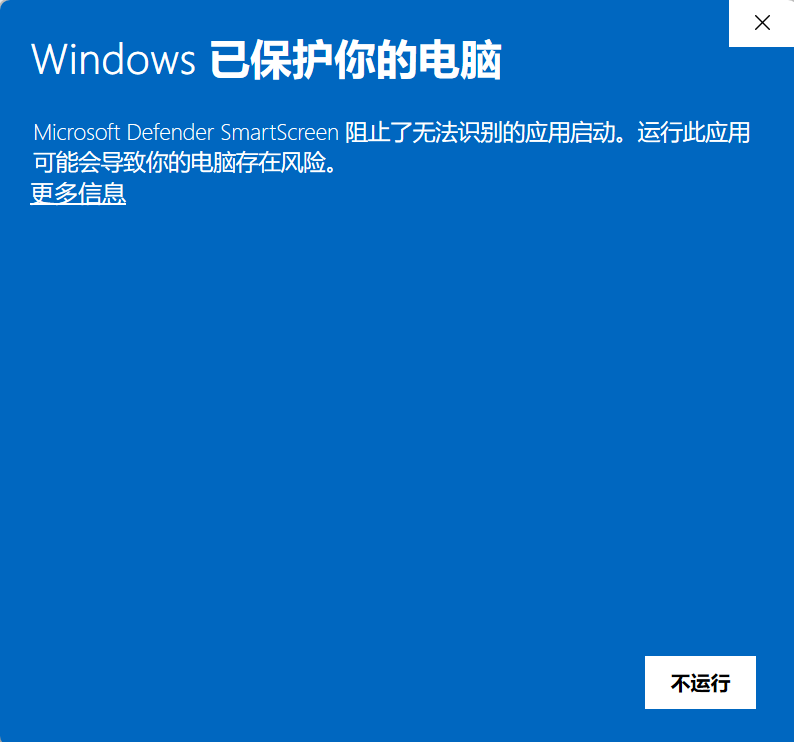
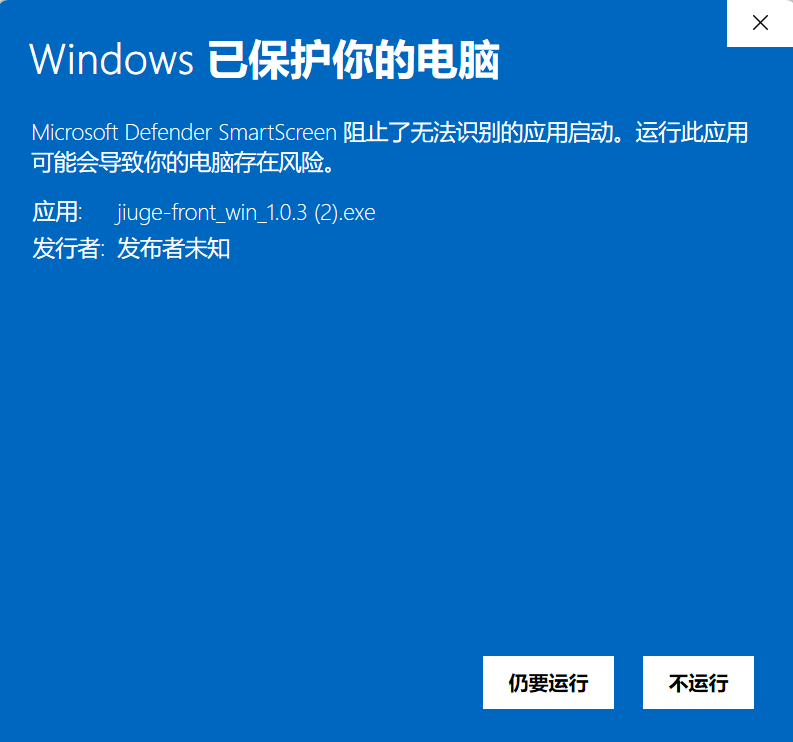
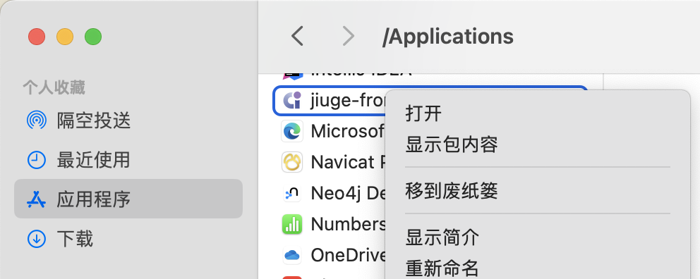
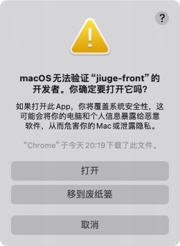
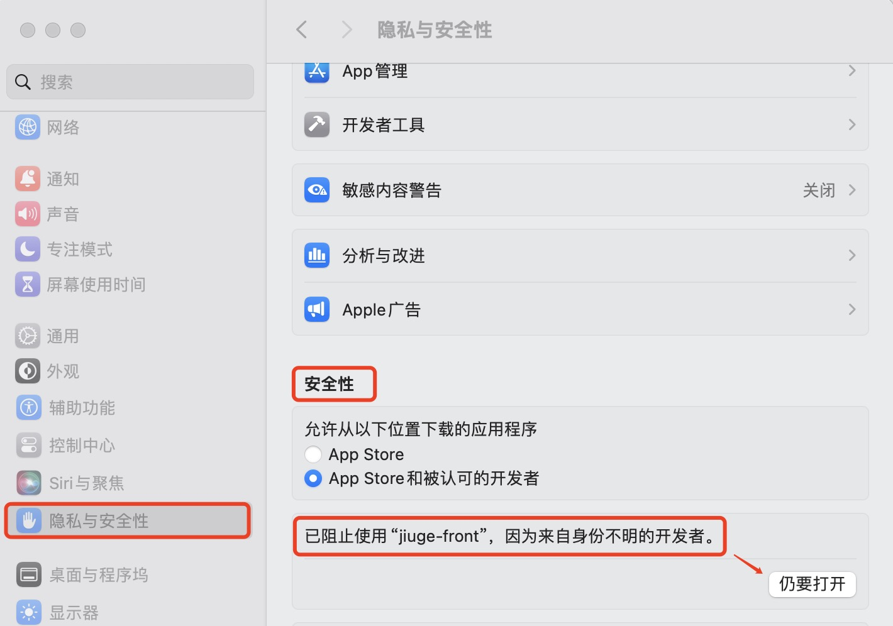
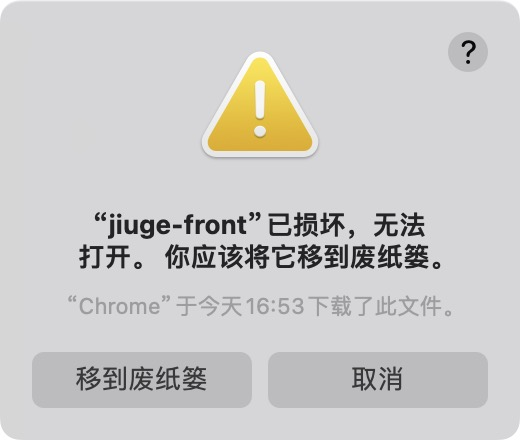
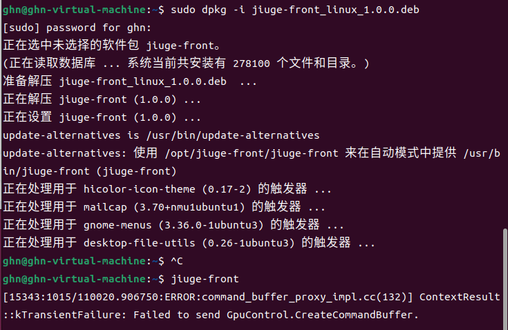
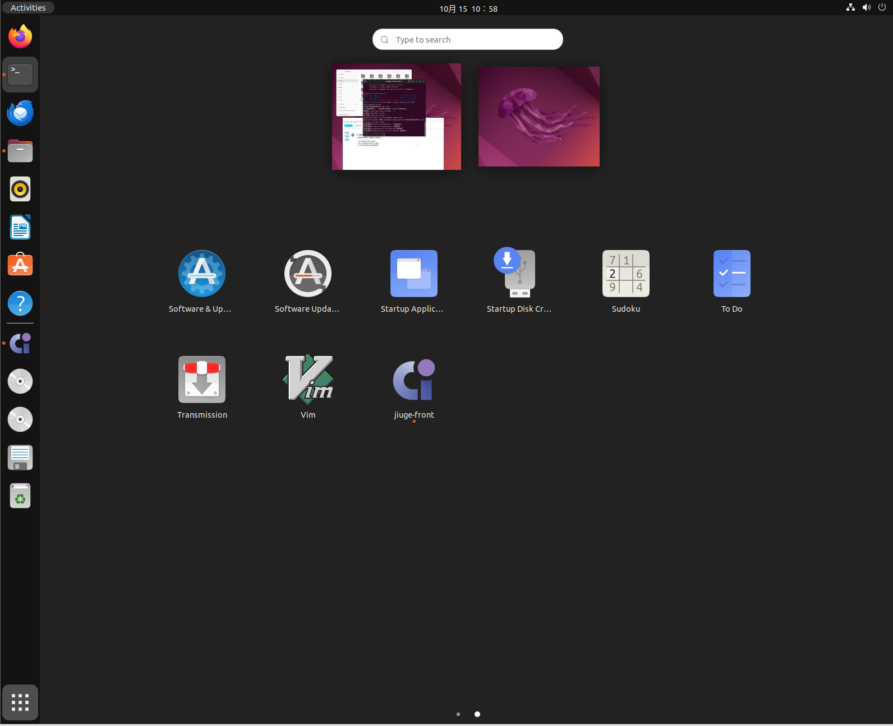

# 使用方法

<!--TOC-->
- [使用方法](#使用方法)
  - [介绍](#介绍)
  - [方法一：源码方式运行，支持自定义修改](#方法一源码方式运行支持自定义修改)
  - [方法二：使用静态服务器](#方法二使用静态服务器)
  - [方法三：使用nginx](#方法三使用nginx)
  - [方法四：使用 docker](#方法四使用-docker)
  - [方法五 桌面应用](#方法五-桌面应用)
    - [win](#win)
    - [mac x64](#mac-x64)
      - [通过 Application](#通过-application)
      - [通过 系统设置](#通过-系统设置)
      - [通过 命令行](#通过-命令行)
    - [mac arm64](#mac-arm64)
    - [linux](#linux)
      - [安装](#安装)
      - [启动](#启动)

## 介绍

+ 本前端项目是适配九格大模型服务api的对应前端实现，支持分支对话
  
+ 增加了对于开源大模型的对话支持，后续考虑增加对开源大模型的分支对话实现

+ 项目使用 `vue3` + `vite` 搭建，`node`版本需要 `>= 16`

+ dist目录是前端打包后的文件，需要使用某种载体使其运行

## 方法一：源码方式运行，支持自定义修改

+ 安装nodejs

```
npm install
```

```
npm run dev
```

项目默认运行在本地的`8011`端口


## 方法二：使用静态服务器

项目已经经过打包，生成了`dist`目录

+ 安装nodejs

+ 配置简单服务器

```
npm install -g http-server
http-server dist -p 8080
```
或者
```
npm install -g serve
serve -s dist -l 8080
```

## 方法三：使用nginx

+ 需要自行安装nginx

+ 其中nginx配置文件`nginx.conf`已经提供，替换`nginx/conf/nginx.conf`文件即可

+ `dist`目录放进 `nginx/html` 目录下
  
+ 启动nginx即可


```
#user  nobody;
worker_processes  1;

#pid        logs/nginx.pid;


events {
    worker_connections  1024;
}

http {
    include       mime.types;
    default_type  application/octet-stream;

    server {
        listen       80;
        server_name  jiuge-frontend;

        location / {
            root /绝对路径/nginx/html;
            index  index.html index.htm;
            try_files $uri $uri/ @router;
        }
        
        location @router {
            rewrite ^.*$ /index.html last;
        }

    }
}
```

## 方法四：使用 docker

+ 分别生成了各个平台下的docker镜像，在目录docker下，包含nginx和前端项目，一键启动即可

  + linux/amd64
  + linux/arm64
  + linux/arm/v7
  + linux/arm/v6
  + linux/ppc64le
  + linux/s390x
  + linux/386

```
docker load -i jiuge_latest_xx.tar
```

其中8080是本地端口，可以修改
```
docker run -d -p 8080:80 jiuge-xx:latest
```

## 方法五 桌面应用

在release页面下载对应平台的安装包进行安装和使用，目前支持 win，mac x64，mac arm64和linux，可能遇到的安装问题请参考如下文档

### win

在win上安装可能遇到风险提示，点击下图【更多信息】展开


点击【仍要运行】即可正常进行安装



### mac x64

直接打开显示如下：无法打开"jiuge-front"因为无法验证开发者


#### 通过 Application

应用程序，按住control键，点击【jiuge-front】应用图标，点击打开


会出现如下提示，选择【打开】


#### 通过 系统设置

（1）系统左上角【苹果图标】 -- 选择【系统设置】-- 【隐私与安全性】--【安全性】
选择【仍然打开】



（2）点击【jiuge-front】图标打开

#### 通过 命令行

```
sudo xattr -rd com.apple.quarantine /Applications/jiuge-front.app
```

### mac arm64

由于arm对安装软件的限制，默认点击打开会显示【已损坏】，无法打开


需要在终端执行命令，进行权限设置和修复
```
sudo xattr -cr /Applications/jiuge-front.app
```

### linux

#### 安装

终端执行
```
sudo dpkg -i jiuge-front_linux_1.0.0.deb
```


#### 启动
（1）终端执行
```
jiuge-front
```

（2）在左下角可以找到安装的应用

